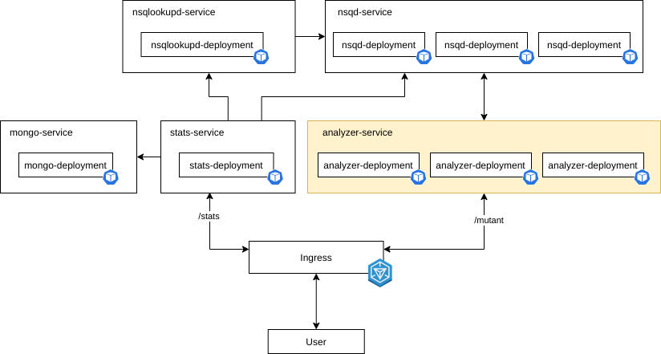

# Magneto DNA Analyzer

Original exercise specs are located under `docs/mutantes.pdf`.

## Build instructions

Docker and Compose are required to run the project locally
(see [Install Docker Compose](https://docs.docker.com/compose/install/) for installation instructions).

Once the tools are installed, to build and start the environment just run the following command in the repo root.
```bash
$ docker-compose up
```
This will pull and build images for the API gateway (nginx), DB (mongo), MQ (nsq) as well as analyzer and stats services.

The gateway exposes the required endpoints (`/mutant` and `/stats`) on port 8080, this can be changed on line 8
of `docker-compose.yaml`.


## Architecture

To maximize throughput, the architecture was thought in a way where stressed components can be scaled horizontally, reducing
response times and error rates during peak loads.

The microservice architecture is composed of 3 main components.

- Analyzers (N units): provides an endpoint for dna analysis (this service is scaled under heavy load)
- Stats: subscribed on a MQ for incomming dna analysis results, exposes a stats resource
- MQ: works both, as a buffer and as a decoupling mechanism between analyzers and stats service

## Deployed infrastructure

Every component was packed into docker images to simplify deployment.
Deployed configuration is as follows:

- Kubernetes cluster on GCP with 3 nodes.
- 3 replicas for analyzer service
- 3 replicas for nsqd (MQ daemon that handles message delivery)
- 1 replica for stats service
- 1 replica for nsqlookupd (MQ registry daemon)
- 1 replica for mongodb
- Ingress gateway for API routing

All services can be replicated for improved availability, removing SPOFs.

Gateway IP: `34.120.180.228`



## Examples

Described examples in the spec file can be executed as follows:

### Analyze DNA
```bash
curl http://34.120.180.228/mutant -v -d '{"dna":["ATGCGA","CAGTGC","TTATGT","AGAAGG","CCCCTA","TCACTG"]}'
*   Trying 34.120.180.228...
* TCP_NODELAY set
* Connected to 34.120.180.228 (34.120.180.228) port 80 (#0)
> POST /mutant HTTP/1.1
> Host: 34.120.180.228
> User-Agent: curl/7.64.1
> Accept: */*
> Content-Length: 63
> Content-Type: application/x-www-form-urlencoded
>
* upload completely sent off: 63 out of 63 bytes
< HTTP/1.1 200 OK
< Date: Tue, 20 Oct 2020 15:28:19 GMT
< Content-Length: 0
< Via: 1.1 google
<
* Connection #0 to host 34.120.180.228 left intact
* Closing connection 0
```

### Query stats
```bash
curl http://34.120.180.228/stats -v
* Expire in 0 ms for 6 (transfer 0x560c19504f50)
*   Trying 34.120.180.228...
* TCP_NODELAY set
* Expire in 200 ms for 4 (transfer 0x560c19504f50)
* Connected to 34.120.180.228 (34.120.180.228) port 80 (#0)
> GET /stats HTTP/1.1
> Host: 34.120.180.228
> User-Agent: curl/7.64.1
> Accept: */*
> 
< HTTP/1.1 200 OK
< Content-Type: application/json
< Date: Tue, 20 Oct 2020 15:30:05 GMT
< Content-Length: 53
< Via: 1.1 google
< 
{"count_mutant_dna":1,"count_human_dna":1,"ratio":1}
* Connection #0 to host 34.120.180.228 left intact
```

## Load testing

Due to resource constraints, test could only be performed with only 10.000 clients per second using
free loader.io service.

For that load, 270ms average response time was achieved with 3 replicas working at 60% and 0% error rate.

## Algorithm description
To analyze whether a subject is a mutant or not, its DNA is traversed in all 4 directions, up, down,
bottom-left -> top-right and top-left -> bottom-right. 

For each strand of DNA, the algorithm performs an optimized search for equal characters as following:

For each nitrogenous base of the strand:
   - If it's different from the previous, reset **count**, otherwise, increment **count** by one.
   - If **count** is equal or greater than 4 increment **repsCount**.
   - If **repsCount** is greater than a certain limit (2), return **repsCount**
   
This visits each nitrogenous base once for each, thus the algorithm has O(N^2)
time complexity where N is the dimension of the DNA matrix (N^2 is the number of
nitrogenous bases), and as strands (of 2N as maximum length) are generated, the space
complexity is O(N).

Space complexity can be improved to O(1) if strands are not buffered, instead they are analyzed base by base without building
the strand).

## Algorithm implementation

Implementation of the algorithm leverages the pipeline pattern (similar to a MapReduce job) using Go channels and gorutines.
Generators receive the DNA matrix and generates all strands for a certain direction.

Generators produce strands concurrently, which then are merged into a single producer. This is fed into a consumer that performs
the previously described algorithm on each strand. When the limit of 2 repeated sequences are reached, generators
are signaled to stop and the result is returned.


### Observations

Repetead sequences can overlap, that means, that a nitrogenous base can be part of more than one sequence. If
it were desired to not overlap, a hash set of positions could be added to keep track of already seen repeated
sequences.
